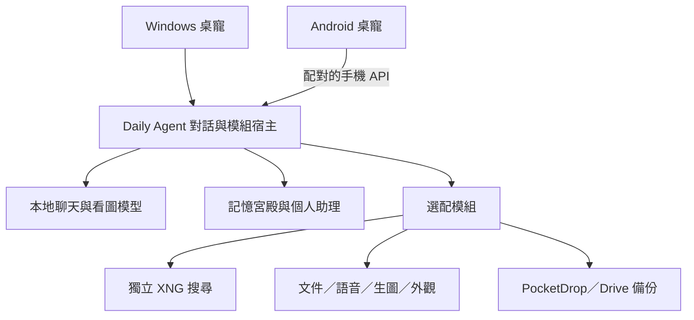

<div align="center">

# Daily Agent

### 住在桌面，也記得你的日常。

**本地 AI × 記憶宮殿 × 個人助理 × 電腦與手機桌寵**


**[⬇ 電腦一鍵安裝](https://github.com/OverGreen996/Daily-Agent/releases/latest/download/DailyAgent-Setup.exe)** · **[⬇ Android APK](https://github.com/OverGreen996/Daily-Agent/releases/download/android-preview-10/DailyPet-Android.apk)** · **[第一次使用](daily-agent/docs/快速開始.md)**

[現版本介紹](daily-agent/docs/現版本介紹.md) · [完整教學](daily-agent/deploy/使用教學.md) · [更新紀錄](daily-agent/CHANGELOG.md) · [最新發布](https://github.com/OverGreen996/Daily-Agent/releases/latest)

</div>

---

Windows 桌寵搭配本地 AI 模型，提供繁體中文對話、記憶宮殿、行程與待辦，也能選配搜尋、文件、語音、生圖及 Android 手機連線。模型在自己的電腦執行，額外功能按需要下載。

> **第一次安裝，只需下載電腦 EXE。** 基本模型會自動下載，語音、生圖、搜尋等功能需要時再勾選。手機 APK 獨立下載，不放進電腦安裝包。

## 目前版本，下載哪一個？

版本資訊於 **2026-10-04** 核對。Windows 與 Android 各自發布；公開安裝版和持續更新的原始碼有明確區別。

| 項目 | 目前版本／狀態 | 入口 |
| --- | --- | --- |
| Windows 安裝版 | **0.2.2 預覽版 · release 12**，2026-10-03 發布 | [發布與附件](https://github.com/OverGreen996/Daily-Agent/releases/tag/v0.2.2-release-20261003-12) |
| Android 桌寵 | **0.1.0-preview.10 · versionCode 10** | [APK 發布與校驗](https://github.com/OverGreen996/Daily-Agent/releases/tag/android-preview-10) |
| 最新原始碼 | 預設分支 `codex/initial-release`；另有 XNG 更新管理入口等後續改動 | [開發指南](daily-agent/docs/開發與發布.md) |
| 選配 XNG | 獨立核心 `2026.10.03-2058`／來源規則 `2026.10.03-1` | [獨立工具與教學](https://github.com/OverGreen996/XNG-Plugin) |

**一般使用者選安裝器，開發者才選原始碼。** GitHub 的 Source code ZIP 不等於可安裝版本；更新 README 或 Git 原始碼不會自動替換既有 EXE／APK。[功能與版本界線 →](daily-agent/docs/現版本介紹.md)

## 下載與開始使用

| 你要做什麼 | 下載／教學 |
| --- | --- |
| 在電腦安裝 | [下載 DailyAgent-Setup.exe](https://github.com/OverGreen996/Daily-Agent/releases/latest/download/DailyAgent-Setup.exe) |
| 在手機安裝 | [下載 DailyPet-Android.apk](https://github.com/OverGreen996/Daily-Agent/releases/download/android-preview-10/DailyPet-Android.apk)，或掃描電腦安裝器上的 QR Code |
| 看本次發布內容 | [最新版發布頁](https://github.com/OverGreen996/Daily-Agent/releases/latest) |
| 核對電腦下載檔 | [SHA256SUMS.txt](https://github.com/OverGreen996/Daily-Agent/releases/latest/download/SHA256SUMS.txt) |
| 安裝出現問題 | [完整中文安裝與排錯手冊](daily-agent/deploy/使用教學.md) |

1. 電腦雙擊 **DailyAgent-Setup.exe**，按「安裝並開始使用」。
2. 保留「安裝後自動準備基本功能」，等待下載及配置完成。
3. 桌寵出現後點一下開聊天，再點收合，開始打字。

一般安裝不需要另外下載 ZIP、校驗檔、Node 或手動輸入 PowerShell。基本版首次預留約 **12 GB** 空間，包含下載與解壓暫存；語音、生圖等功能另計，設定畫面會顯示估算。首次配置需要網路，不是離線全模型包。

桌面有兩個主要入口：**Daily Agent** 開桌寵，**Daily Agent 功能與設定** 補裝、修復及管理。下載中斷或重開機後，從設定視窗繼續。

## 安裝後，試著對它說

| 你可以說 | 它會做什麼 |
| --- | --- |
| 「記住我叫小明，我是設計師」 | 保存明確告知的個人資料 |
| 「我明天下午三點要開會」→「我明天要幹嘛」 | 記錄行程，再查詢安排 |
| 「新增待辦 明天15:00 繳費」 | 加入助理待辦 |
| 「幫我搜尋最新 AI 新聞，附上來源」 | 使用已配置的搜尋模組，保留日期與證據限制 |
| 「幫我完整摘要這份文件」 | 搭配拖入的文件使用文件模組 |
| 「生圖模式」→描述畫面 | 使用已補裝的生圖模型 |
| 「幫我傳到手機」 | 透過已配對 PocketDrop 分享近期文字回答 |
| 「模組管理器」 | 開啟功能管理入口 |

自然語言仍可能需要確認或重述，完整明確命令見[對話指令表](daily-agent/deploy/對話指令.md)。提醒需要電腦後端開著，不能在關機時通知。

## 功能一覽

| 功能 | 使用方式／條件 |
| --- | --- |
| 本地聊天與看圖 | Qwen3.5 4B；核心模型由安裝流程下載 |
| 記憶宮殿 | 保存個人資料、喜好與對話，可查閱及管理 |
| 日常助理 | 行程、待辦、筆記、習慣與 ICS 行事曆匯入 |
| 網路搜尋 | 接入獨立 XNG Hub，使用來源證據；另有免費本機搜尋備援，需配置 |
| 文件問答 | 匯入、摘要、比較與 OCR；掃描文件需要 Windows OCR 語言 |
| 語音 | 可選語音朗讀、中文語音輸入與音訊設備設定 |
| 本地生圖 | 可選動漫／真人模型；圖片顯示在手機聊天框，提示詞不寫入記憶宮殿 |
| Android 桌寵 | 配對電腦、使用手機位置，支援點擊收合、縮放拉條與圖片顯示 |
| PocketDrop | 配對自己的 Room，以「幫我傳到手機」等自然語句傳送文字 |
| 寵物外觀編輯器 | 整張動畫圖切格、去背、對齊、播放檢查及匯出；可選本地看圖分類 |
| Google Drive 備份 | OAuth 登入、宮殿快照與下載校驗；需自行提供 OAuth 用戶端，真實帳號驗收待完成 |

完整語句範例見 [對話指令](daily-agent/deploy/對話指令.md)，功能狀態見 [現版本介紹](daily-agent/docs/現版本介紹.md)。

## 設定與模組管理


設定分為「開始使用」「補裝功能」「模組管理器」「連線與維護」。補裝決定下載什麼，模組管理決定哪些功能會載入。停用後完整關閉再重開生效，已有資料與模型保留。

程式版本、模型與使用者資料分開存放。更新保留記憶與設定；卸載可選是否保留記憶宮殿。共用 XNG、Docker、WSL 不歸本安裝管理。

## 搜尋與其他程式串接

[XNG-Plugin 獨立倉庫](https://github.com/OverGreen996/XNG-Plugin)統一維護搜尋工具、安裝與 API 教學；[CF 公開下載站](https://xng-plugins.kentyang1993.workers.dev/)提供核心與規則。先準備自己的 Docker／SearXNG，再安裝 XNG，最後讓 Daily Agent 接入本機 Hub。基本聊天、記憶與行程不依賴 Docker。

更新採「檢查更新 → 確認安裝 → 校驗與回歸 → 重新啟動」，可回復舊版。CF 配送公開檔案，搜尋在使用者自己的電腦執行；下載站網址不能填成搜尋 API。配置順序與 PowerShell 指令見[Daily Agent 的 XNG 接入教學](daily-agent/deploy/XNG接入教學.md)。

原始碼設定視窗已有「模組管理器 → XNG 插件更新」入口。已發布 Windows release 12 尚未重打包，該安裝版請直接雙擊獨立 XNG 的 `Open-XNGPlugin.cmd`；原本的手機網址與 APK 不變。

PocketDrop 則是區域網路的共享 Room：先安裝 [PocketDrop](https://github.com/OverGreen996/PocketDrop)，讓手機加入自己的 Room，再把 Daily Agent 配對到同一 Room。文字分享會取代共享文字，Room 內其他裝置也看得到；它和桌寵的手機聊天配對是兩件事。[完整 PocketDrop 順序 →](daily-agent/deploy/PocketDrop接入教學.md)

## 手機使用順序

<div align="center">


掃碼下載 APK，也可使用頁首的 Android 下載按鈕。

</div>

1. 先完成電腦安裝，再掃 QR Code 或下載上方 APK。
2. 依 Android 提示安裝，授予需要的懸浮窗等權限。
3. 電腦開啟手機配對，手機輸入自己的連線網址與限時配對碼。
4. 手機即可連回電腦聊天。下載 APK 時電腦可以關機，聊天及生圖時電腦和 Agent 必須開著。

外網連線使用**每位使用者自己的 Cloudflare 帳號及網址**，沒有內附作者的網域或權杖。設定順序見 [手機與 Cloudflare 教學](daily-agent/deploy/使用教學.md#5-手機配對與-cloudflare)。

**Preview 9 或更舊的 APK 要先移除再安裝 Preview 10，並重新配對。** 本版更換固定的新簽章，舊手機設定會清除，電腦記憶宮殿保留；Preview 10 之後沿用同一把金鑰更新。

## 中文教學索引

| 主題 | 文件 |
| --- | --- |
| 從零安裝、額外依賴、PowerShell、排錯、卸載 | [安裝與操作手冊](daily-agent/deploy/使用教學.md) |
| 想先完成電腦與手機的基本流程 | [快速開始](daily-agent/docs/快速開始.md) |
| 現版本功能、需求與限制 | [現版本介紹](daily-agent/docs/現版本介紹.md) |
| 所有對話指令與範例 | [對話指令](daily-agent/deploy/對話指令.md) |
| XNG 安裝順序與 API 串接 | [XNG 接入教學](daily-agent/deploy/XNG接入教學.md) |
| PocketDrop 安裝與配對 | [PocketDrop 教學](daily-agent/deploy/PocketDrop接入教學.md) |
| Google Cloud OAuth 與 Drive 備份 | [Google Drive 備份教學](daily-agent/deploy/GoogleDrive備份教學.md) |
| 手機操作、權限與 APK 建置 | [Android 說明](daily-agent/android/README.md) |
| 皮膚尺寸、透明度及動畫規格 | [寵物皮膚製作標準](daily-agent/deploy/寵物皮膚規格.md) |
| GPT 動畫圖匯入與微調 | [動畫圖匯入教學](daily-agent/deploy/動畫圖匯入教學.md) |
| 模組／插件／API 與資料目錄 | [維護架構](daily-agent/ARCHITECTURE.md) |
| 原始碼、測試及發布 | [開發與發布指南](daily-agent/docs/開發與發布.md) |
| 本版實測與未驗收範圍 | [驗證紀錄](daily-agent/VALIDATION.md) |

## 更新

Windows 更新資訊：[update.json](https://github.com/OverGreen996/Daily-Agent/releases/latest/download/update.json)。已安裝者在一般 PowerShell 執行：

```powershell
powershell -NoProfile -ExecutionPolicy Bypass -File "$env:LOCALAPPDATA\DailyAgent\Update-DailyAgent.ps1" -Install
```

自訂安裝位置請改成自己的安裝根目錄。工具下載 Windows ZIP 並驗證 SHA-256，完成後重開桌寵。手機版本接口為電腦連線入口的 `/v1/updates?versionCode=10`；目前沒有 App 自動更新畫面，安裝仍需 Android 確認。APK 由獨立 GitHub 發布提供，沒有放進電腦安裝包。

回復上一個已安裝程式版本：

```powershell
powershell -NoProfile -ExecutionPolicy Bypass -File "$env:LOCALAPPDATA\DailyAgent\Launch-DailyAgent.ps1" -Rollback
```

回復程式不等於還原記憶資料庫。[更新、備份與卸載細節 →](daily-agent/deploy/使用教學.md)

## 為什麼要分模組？



聊天與記憶是主線，額外功能各自有入口、工具、API 與資源清理。**補裝**決定下載什麼，**停用**決定下次啟動載入什麼；停用保留既有資料。開發者可依共同接口新增插件，詳見[維護架構](daily-agent/ARCHITECTURE.md)。

## 常見疑問

<details>
<summary><strong>安裝後會自動下載模型嗎？需要一次準備 60 GB 嗎？</strong></summary>

保持「安裝後自動準備基本功能」勾選，首次會下載基本模型。基本版先預留約 12 GB，包含下載與解壓暫存；生圖、語音等按需補裝，以設定畫面的當下估算為準。不會預設下載所有模型。

</details>

<details>
<summary><strong>只是電腦聊天，也要 Docker、Cloudflare 或網域嗎？</strong></summary>

基本聊天、記憶與行程不用。Docker 用於本機搜尋；Cloudflare 用於選配的外網手機連線。Quick Tunnel 可先測試，固定網址才需要自己的網域和通道設定。

</details>

<details>
<summary><strong>手機能離開電腦獨立聊天或生圖嗎？</strong></summary>

模型在電腦執行，手機需要連回開著的電腦與 Agent。APK 可直接從 GitHub 下載，下載時電腦不需要開機。

</details>

<details>
<summary><strong>卸載會清掉所有記憶嗎？Drive 會自動備份嗎？</strong></summary>

卸載時可選保留記憶宮殿。Drive 備份預設不自動上傳，需自己的 OAuth 設定與帳號授權；目前下載校驗不會自動覆蓋現有宮殿。更新或回復程式不能替代資料備份。

</details>

## 開發者入口

需要 Windows、Git 與 Node 24。在 PowerShell 執行：

```powershell
git clone https://github.com/OverGreen996/Daily-Agent.git
cd Daily-Agent
cd daily-agent
npm.cmd ci
npm.cmd test
cd ..
powershell -NoProfile -ExecutionPolicy Bypass -File .\Open-DailyManager.ps1
```

原始碼與安裝版路徑不同，不要同時啟動。首次測試會準備 tokenizer，不下載模型權重；原生編譯的額外工具見[開發與發布指南](daily-agent/docs/開發與發布.md)。問題與建議可附去除私人資料的版本、步驟和錯誤訊息到 [GitHub Issues](https://github.com/OverGreen996/Daily-Agent/issues)。

## 系統需求與目前限制

Windows x64；本輪以 NVIDIA RTX 3080 Ti 12 GB 配置驗證。本地生圖需要相容的 NVIDIA 驅動與足夠顯存，詳見安裝教學；Android 8 以上。一般使用者不需要 Android SDK，修改原始碼才需要開發工具。

目前仍為預覽版。Windows 安裝器尚未簽章；Android 實機觸控、系統權限、背景耗電尚未完整驗收。Google 真實帳號登入／備份與 PocketDrop 真實 Room 仍需配置後驗收。來源日期與未核實內容會保留，搜尋與模型仍可能有錯誤。

發布內容不包含個人記憶、配對憑證、私密設定、模型權重或 APK 私鑰。公開原始碼不改變第三方模型、依賴或角色素材的授權，再散布前請核對各自條款。
