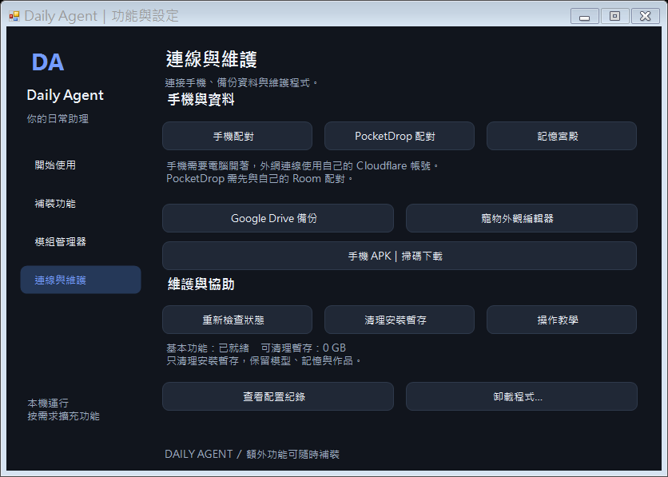

# Daily Agent｜你的本地日常助理

Windows 桌寵搭配本地 AI 模型，提供繁體中文對話、記憶宮殿、行程與待辦，也能選配搜尋、文件、語音、生圖及 Android 手機連線。模型在自己的電腦執行，額外功能按需要下載。

**目前版本：Windows 0.2.2 預覽版／Android Preview 10（2026-10-03）。** 本次整合模組化重整、安裝流程、外觀編輯器與新版 XNG 接口。詳見 [現版本介紹](daily-agent/docs/現版本介紹.md) 與 [更新紀錄](daily-agent/CHANGELOG.md)。

## 下載與開始使用

| 你要做什麼 | 下載／教學 |
| --- | --- |
| 在電腦安裝 | [下載 DailyAgent-Setup.exe](https://github.com/OverGreen996/Daily-Agent/releases/latest/download/DailyAgent-Setup.exe) |
| 在手機安裝 | [下載 DailyPet-Android.apk](https://github.com/OverGreen996/Daily-Agent/releases/download/android-preview-10/DailyPet-Android.apk)，或掃描電腦安裝器上的 QR Code |
| 看本次發布內容 | [最新版發布頁](https://github.com/OverGreen996/Daily-Agent/releases/latest) |
| 安裝出現問題 | [完整中文安裝與排錯手冊](daily-agent/deploy/使用教學.md) |

1. 電腦雙擊 **DailyAgent-Setup.exe**，按「安裝並開始使用」。
2. 保留「安裝後自動準備基本功能」，等待下載及配置完成。
3. 桌寵出現後點一下開聊天，再點收合，開始打字。

一般安裝不需要另外下載 ZIP、校驗檔、Node 或手動輸入 PowerShell。基本版首次預留約 **12 GB** 空間，包含下載與解壓暫存；語音、生圖等功能另計，設定畫面會顯示估算。首次配置需要網路，不是離線全模型包。

桌面有兩個主要入口：**Daily Agent** 開桌寵，**Daily Agent 功能與設定** 補裝、修復及管理。下載中斷或重開機後，從設定視窗繼續。

## 能做什麼

| 功能 | 使用方式／條件 |
| --- | --- |
| 本地聊天與看圖 | Qwen3.5 4B；核心模型由安裝流程下載 |
| 記憶宮殿 | 保存個人資料、喜好與對話，可查閱及管理 |
| 日常助理 | 行程、待辦、筆記、習慣與 ICS 行事曆匯入 |
| 網路搜尋 | 接入獨立 XNG Hub，使用來源證據；另有免費本機搜尋備援 |
| 文件問答 | 匯入、摘要、比較與 OCR；掃描文件需要 Windows OCR 語言 |
| 語音 | 可選語音朗讀、中文語音輸入與音訊設備設定 |
| 本地生圖 | 可選動漫／真人模型；圖片顯示在手機聊天框，提示詞不寫入記憶宮殿 |
| Android 桌寵 | 配對電腦、使用手機位置，支援點擊收合、縮放拉條與圖片顯示 |
| PocketDrop | 配對自己的 Room，以「幫我傳到手機」等自然語句傳送文字 |
| 寵物外觀編輯器 | 整張動畫圖切格、去背、對齊、播放檢查及匯出；可選本地看圖分類 |
| Google Drive 備份 | OAuth 登入、宮殿快照與下載校驗；需自行提供 OAuth 用戶端，真實帳號驗收待完成 |

完整語句範例見 [對話指令](daily-agent/deploy/對話指令.md)，功能狀態見 [現版本介紹](daily-agent/docs/現版本介紹.md)。

## 設定與模組管理



設定分為「開始使用」「補裝功能」「模組管理器」「連線與維護」。補裝決定下載什麼，模組管理決定哪些功能會載入。停用後完整關閉再重開生效，已有資料與模型保留。

程式版本、模型與使用者資料分開存放。更新保留記憶與設定；卸載可選是否保留記憶宮殿。共用 XNG、Docker、WSL 不歸本安裝管理。

## XNG 獨立插件與 Cloudflare 更新

[XNG 插件站](https://xng-plugins.kentyang1993.workers.dev/) 提供核心、獨立管理工具、公開更新索引和中文 API 教學。所有程式可以下載同一版本，或共用本機 `127.0.0.1:8889`。搜尋核心不必隨 Daily Agent 重裝。

更新採「檢查更新 → 確認安裝 → 校驗與回歸 → 重新啟動」，可回復舊版。Cloudflare 目前託管下載與更新檔；搜尋執行於自己的 XNG 主機，沒有公開個人桌寵的 API。詳見 [插件使用與維護](daily-agent/integrations/xng-plugin/README.md)。

原始碼設定視窗已有「模組管理器 → XNG 插件更新」入口。已發布 Windows release 12 尚未重打包，該安裝版請直接雙擊獨立 XNG 的 `Open-XNGPlugin.cmd`；原本的手機網址與 APK 不變。

## 手機使用順序

1. 先完成電腦安裝，再掃 QR Code 或下載上方 APK。
2. 依 Android 提示安裝，授予需要的懸浮窗等權限。
3. 電腦開啟手機配對，手機輸入自己的連線網址與限時配對碼。
4. 手機即可連回電腦聊天。下載 APK 時電腦可以關機，聊天及生圖時電腦和 Agent 必須開著。

外網連線使用**每位使用者自己的 Cloudflare 帳號及網址**，沒有內附作者的網域或權杖。設定順序見 [手機與 Cloudflare 教學](daily-agent/deploy/使用教學.md#5-手機配對與-cloudflare)。

**Preview 9 或更舊的 APK 要先移除再安裝 Preview 10，並重新配對。** 本版更換固定的新簽章，舊手機設定會清除，電腦記憶宮殿保留；Preview 10 之後沿用同一把金鑰更新。

## 中文教學索引

| 主題 | 文件 |
| --- | --- |
| 從零安裝、額外依賴、PowerShell、排錯、卸載 | [安裝與操作手冊](daily-agent/deploy/使用教學.md) |
| 現版本功能、需求與限制 | [現版本介紹](daily-agent/docs/現版本介紹.md) |
| 所有對話指令與範例 | [對話指令](daily-agent/deploy/對話指令.md) |
| XNG 安裝順序與 API 串接 | [XNG 接入教學](daily-agent/deploy/XNG接入教學.md) |
| PocketDrop 安裝與配對 | [PocketDrop 教學](daily-agent/deploy/使用教學.md#pocketdrop-區域網路串接) |
| Google Cloud OAuth 與 Drive 備份 | [Google Drive 備份教學](daily-agent/deploy/GoogleDrive備份教學.md) |
| 手機操作、權限與 APK 建置 | [Android 說明](daily-agent/android/README.md) |
| 皮膚尺寸、透明度及動畫規格 | [寵物皮膚製作標準](daily-agent/deploy/寵物皮膚規格.md) |
| GPT 動畫圖匯入與微調 | [動畫圖匯入教學](daily-agent/deploy/動畫圖匯入教學.md) |
| 模組／插件／API 與資料目錄 | [維護架構](daily-agent/ARCHITECTURE.md) |
| 原始碼、測試及發布 | [開發與發布指南](daily-agent/docs/開發與發布.md) |
| 本版實測與未驗收範圍 | [驗證紀錄](daily-agent/VALIDATION.md) |

## 更新

Windows 更新資訊：[update.json](https://github.com/OverGreen996/Daily-Agent/releases/latest/download/update.json)。已安裝者在一般 PowerShell 執行：

```powershell
powershell -NoProfile -ExecutionPolicy Bypass -File "$env:LOCALAPPDATA\DailyAgent\Update-DailyAgent.ps1" -Install
```

自訂安裝位置請改成自己的安裝根目錄。工具下載 Windows ZIP 並驗證 SHA-256，完成後重開桌寵。手機版本接口為電腦連線入口的 `/v1/updates?versionCode=10`；目前沒有 App 自動更新畫面，安裝仍需 Android 確認。APK 由獨立 GitHub 發布提供，沒有放進電腦安裝包。

## 系統需求與目前限制

Windows x64；本輪以 NVIDIA RTX 3080 Ti 12 GB 配置驗證。本地生圖需要相容的 NVIDIA 驅動與足夠顯存，詳見安裝教學；Android 8 以上。一般使用者不需要 Android SDK，修改原始碼才需要開發工具。

目前仍為預覽版。Windows 安裝器尚未簽章；Android 實機觸控、系統權限、背景耗電尚未完整驗收。Google 真實帳號登入／備份與 PocketDrop 真實 Room 仍需配置後驗收。來源日期與未核實內容會保留，搜尋與模型仍可能有錯誤。

發布內容不包含個人記憶、配對憑證、私密設定、模型權重或 APK 私鑰。公開原始碼不改變第三方模型、依賴或角色素材的授權，再散布前請核對各自條款。
