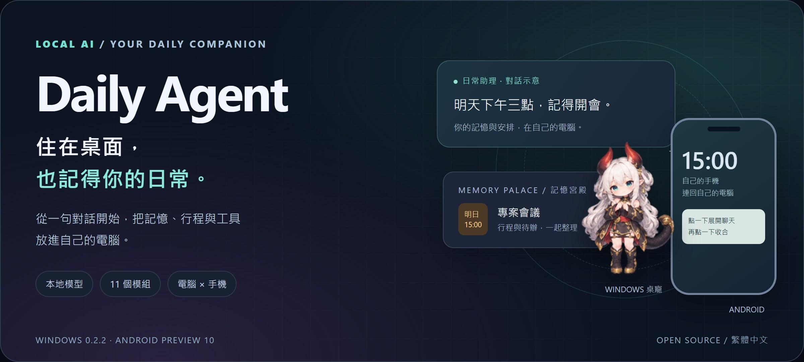
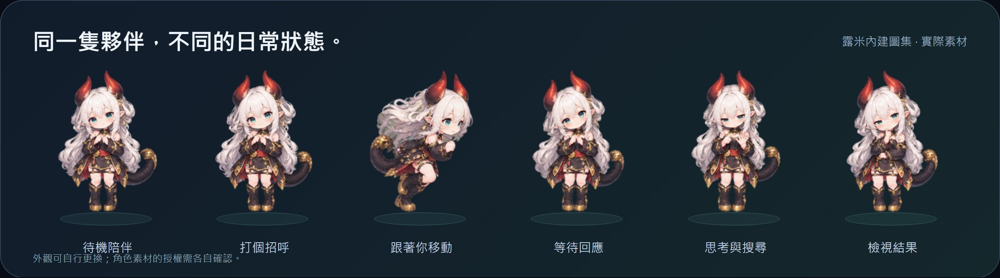
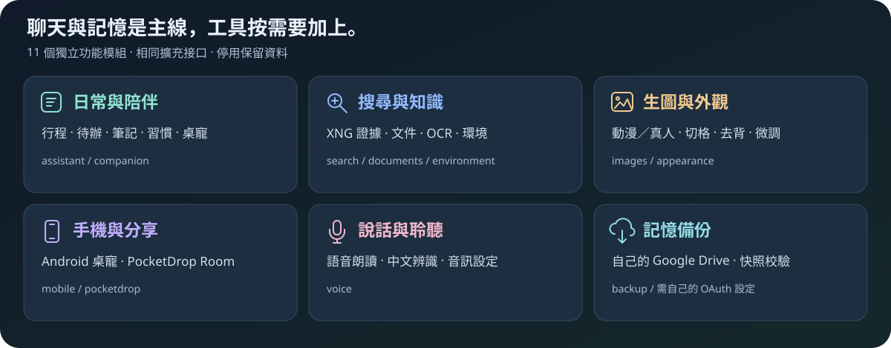

<picture>
  <source media="(max-width: 700px)" srcset="daily-agent/docs/images/readme-hero-mobile.jpg">
  
</picture>

<div align="center">

# Daily Agent

**一隻桌寵，也是一位懂你日常的本地 AI 助理。**

在自己的電腦聊天、記憶與創作，讓手機也能連回來。<br>繁體中文介面，基本模型自動配置，額外工具按需要加上。

   

<a href="https://github.com/OverGreen996/Daily-Agent/releases/latest/download/DailyAgent-Setup.exe"></a> <a href="https://github.com/OverGreen996/Daily-Agent/releases/download/android-preview-10/DailyPet-Android.apk"></a> <a href="daily-agent/docs/快速開始.md"></a>

[功能展示](#功能展示) · [開始使用](#開始使用) · [手機桌寵](#手機桌寵) · [外觀創作](#外觀創作) · [模組與串接](#模組與串接) · [中文教學](#中文教學)

</div>

> [!TIP]
> **第一次來，只下載 Windows EXE。** 雙擊 → 自動準備基本模型 → 開始聊天。手機 APK 獨立下載；搜尋、語音、生圖等需要時再補裝。

## 功能展示

### 記得你，也幫你整理日常

<table>
<tr>
<td width="50%" valign="top">
<h3>01 / 記憶宮殿</h3>
<p>姓名、工作、喜好與對話保存在自己的電腦。可以查閱、管理，再透過自己的 Drive 備份。</p>
<blockquote>「記住我叫小明，我是設計師。」</blockquote>
</td>
<td width="50%" valign="top">
<h3>02 / 日常助理</h3>
<p>行程、待辦、筆記、習慣與 ICS 行事曆匯入，把口頭安排變成下次可查的資料。</p>
<blockquote>「我明天下午三點要開會。」<br>「我明天要幹嘛？」</blockquote>
</td>
</tr>
<tr>
<td valign="top">
<h3>03 / 搜尋與閱讀</h3>
<p>XNG 帶回來源、日期與證據；文件模組處理摘要、比較與 OCR，資料不足時保留未核實狀態。</p>
<blockquote>「幫我搜尋最新 AI 新聞，附上來源。」</blockquote>
</td>
<td valign="top">
<h3>04 / 語音與創作</h3>
<p>按需下載語音朗讀、中文語音辨識、動漫或真人生圖模型。圖片可以在手機聊天中查看。</p>
<blockquote>「生圖模式」→ 描述想要的畫面。</blockquote>
</td>
</tr>
<tr>
<td valign="top">
<h3>05 / 電腦與手機</h3>
<p>電腦桌寵處理對話，Android 桌寵連回自己的後端。PocketDrop 可分享近期文字回答。</p>
<blockquote>「幫我傳到手機。」</blockquote>
</td>
<td valign="top">
<h3>06 / 自己的外觀</h3>
<p>匯入透明素材或整張動畫圖，用外觀編輯器切格、去背、對齊、檢查跳動與手動微調。</p>
<blockquote>把自己的角色，變成每天陪伴的桌寵。</blockquote>
</td>
</tr>
</table>

自然語言可能需要確認或重述，[明確指令與範例](daily-agent/deploy/對話指令.md)可直接照著用。提醒需要電腦後端運行，關機時不能通知。

### 功能集中，設定分區


<div align="center"><sub>實際設定畫面 ·「開始使用」「補裝功能」「模組管理器」「連線與維護」四個入口</sub></div>

**補裝**決定下載的資源，**模組管理**決定下次啟動載入的功能。停用保留資料與模型；儲存後完整關閉背景服務再開即可生效。

## 開始使用

### 三步，把助理請進電腦

| ① 下載一個檔案 | ② 等它準備好 | ③ 點桌寵聊天 |
| :--- | :--- | :--- |
| [下載 Windows EXE](https://github.com/OverGreen996/Daily-Agent/releases/latest/download/DailyAgent-Setup.exe)，雙擊「安裝並開始使用」。 | 保持「安裝後自動準備基本功能」勾選，等待下載和配置。 | 點一下打開對話，再點收合；先試記憶和行程。 |

一般安裝不用另找 ZIP、sha256、Node，也不用先輸入 PowerShell。第一次需要網路，基本版預留約 **12 GB**，包含下載和解壓暫存；選配功能另計，以畫面估算為準。

<details>
<summary><strong>裝好後，桌面上的兩個入口怎麼用？</strong></summary>

- **Daily Agent**：啟動桌寵。
- **Daily Agent 功能與設定**：補裝、修復、模組、配對與維護；下載中斷後從這裡繼續。
- **完整停止**：桌寵右鍵 → 關閉桌寵並停止背景服務。

不用一開始全選。聊天、記憶與行程先用起來，再補自己的工具。[從零安裝與排錯 →](daily-agent/deploy/使用教學.md)

</details>

### 需要什麼，再加什麼

| 想做的事 | 選配／設定 |
| --- | --- |
| 聽它說話、用語音輸入 | 語音朗讀、中文辨識模型，再選音訊裝置 |
| 在本地生圖 | 動漫／真人模式分開勾選；需相容 NVIDIA 驅動與足夠顯存 |
| 閱讀掃描文件 | 文件模組及 Windows OCR 語言 |
| 即時搜尋 | 自己的 Docker／SearXNG + 獨立 XNG Hub，或配置搜尋備援 |
| 外網手機連線 | 自己的 cloudflared／Cloudflare 通道與網址 |
| 備份記憶 | 自己的 Google Desktop OAuth 用戶端與 Drive 帳號 |

**基本電腦聊天不依賴 Docker、Cloudflare 或網域。** 不是預設下載所有模型，也不需要把全選功能的空間當成基本版需求。

## 手機桌寵

### 電腦負責思考，手機帶著走

<div align="center">
<a href="https://github.com/OverGreen996/Daily-Agent/releases/download/android-preview-10/DailyPet-Android.apk"></a><br><strong>掃碼下載 APK</strong><br><sub>Android 8+ · 約 2.7 MB</sub>
</div>

**下載 → 配對 → 開聊**

1. 先完成電腦安裝，再掃 QR 或下載 APK。
2. 依 Android 提示安裝、授予所需權限。
3. 電腦說「開啟手機配對」，手機填自己的連線網址及限時 8 位碼。
4. 輕點寵物開／收聊天，長按開設定；大小拉條可調 40%～200%。

手機不下載模型，聊天和生圖需連回開著的電腦與 Agent。APK 可直接從 GitHub 下載，下載時電腦不必開機。外網連線由**每位使用者設定自己的 Cloudflare 帳號與通道**。[手機配對與 Cloudflare →](daily-agent/deploy/使用教學.md#5-手機配對與-cloudflare)

> [!IMPORTANT]
> **Preview 9 以前先移除，再安裝 Preview 10 並重新配對。** 舊手機設定會清除，電腦宮殿保留；Preview 10 之後沿用固定新簽章更新。PocketDrop 是另一個 APK 和配對流程，不能代替桌寵配對。

## 外觀創作

### 把你喜歡的角色，變成自己的夥伴

<picture>
  <source media="(max-width: 700px)" srcset="daily-agent/docs/images/readme-skins-mobile.jpg">
  
</picture>

靜態透明 PNG／WebP 可直接匯入；完整動畫使用 `pet.json` + 圖集的 ZIP。已用 GPT 產生整張動畫圖，也可先丟進編輯器：

```text
匯入動畫圖 → 調整切格 → 去背與腳底對齊 → 檢查連貫性 → 微調 → 匯出外觀包
```

工具提供結構與品質檢查，角色動作仍需播放核對。生圖提示詞不寫入宮殿；生成圖片會保存在本機，使用者可自行清理。

用 **GPT 的 PET／Pets 技能生成角色**，再以快速工具把素材導入安裝版桌寵：

```text
PET 生成 → 下載完整圖集／素材 ZIP → 預覽修正版 → 匯入安裝版 → 選新外觀
```

**[下載 PET 快速匯入工具](https://github.com/OverGreen996/Daily-Agent/releases/download/pet-import-v1.0.0-20261005/DailyAgent-PET-Import.zip)** · **[GPT PET 生成與匯入教學](daily-agent/desktop/PET-QUICK-IMPORT.md)**

解壓後雙擊 `DailyAgent-PET-Import.exe`，不需編譯。原圖解析度與檔案位元組保留；可匯出安裝包分享。預設寫入 **已安裝 Daily Agent 的寵物素材庫**，保留其他寵物與記憶。

**[寵物皮膚製作標準](daily-agent/deploy/寵物皮膚規格.md)** · **[整張動畫圖匯入教學](daily-agent/deploy/動畫圖匯入教學.md)** · [內建動畫圖集](daily-agent/desktop/assets/lumi/contact-sheet.png)

## 模組與串接

### 功能可以分開維護，也能接上其他程式

<picture>
  <source media="(max-width: 700px)" srcset="daily-agent/docs/images/readme-modules-mobile.svg">
  
</picture>

聊天與記憶是主線，額外功能透過相同模組接口提供入口、工具、API 與資源清理。程式版本、共享模型和個人資料分開存放；更新保留設定，卸載可選保留宮殿。[插件接口與維護架構 →](daily-agent/ARCHITECTURE.md)

<details>
<summary><strong>查看 11 個模組與用途</strong></summary>

| 模組 | 功能 |
| --- | --- |
| `assistant` | 行程、待辦、筆記、習慣與行事曆 |
| `companion` | 桌寵陪伴 |
| `search` | XNG 結構化證據與搜尋備援 |
| `documents` | 匯入、摘要、比較與 OCR |
| `environment` | 環境資訊 |
| `images` | 本地生圖 |
| `appearance` | 外觀匯入及動畫圖編輯 |
| `mobile` | Android 配對與手機 API |
| `pocketdrop` | 同一 Room 的共享文字與檔案清單 |
| `voice` | 朗讀、辨識及音訊設定 |
| `backup` | Drive 宮殿快照與下載校驗 |

基本聊天與記憶不靠移除某個模組來刪資料。停用不是卸載，不會立即在進行中的對話熱拔除；需要重開後端。

</details>

### 三個外部工具，各自設定

| 工具 | 在 Daily Agent 的用途 | 接入順序 |
| --- | --- | --- |
| **[XNG-Plugin](https://github.com/OverGreen996/XNG-Plugin)** | 取得可追溯的搜尋證據 | 自己的 SearXNG → XNG → [Agent 接入](daily-agent/deploy/XNG接入教學.md) |
| **[PocketDrop](https://github.com/OverGreen996/PocketDrop)** | 「幫我傳到手機」分享文字 | 安裝 Room → 手機加入 → [Agent 配對](daily-agent/deploy/PocketDrop接入教學.md) |
| **Google Drive** | 備份自己的記憶宮殿 | 自己的 OAuth 設定 → 登入授權 → [備份與校驗](daily-agent/deploy/GoogleDrive備份教學.md) |

XNG 核心與規則獨立更新，CF 站只配送檔案，搜尋在自己的主機。已發布 Windows release 12 使用獨立 `Open-XNGPlugin.cmd`；較新原始碼有模組管理器入口。PocketDrop 分享會取代 Room 的共享文字，其他已配對裝置也看得到。

## 版本與更新

2026-10-04 核對的公開版本：

| 項目 | 目前版本 | 下載／說明 |
| --- | --- | --- |
| Windows 安裝包 | **0.2.2 · release 12** | [發布頁](https://github.com/OverGreen996/Daily-Agent/releases/tag/v0.2.2-release-20261003-12) · [校驗值](https://github.com/OverGreen996/Daily-Agent/releases/latest/download/SHA256SUMS.txt) |
| Android 桌寵 | **0.1.0-preview.10 · versionCode 10** | [APK 發布頁](https://github.com/OverGreen996/Daily-Agent/releases/tag/android-preview-10) |
| 最新原始碼 | **`codex/initial-release`** | 含發行後改動；[與安裝版的區別](daily-agent/docs/現版本介紹.md) |
| 選配 XNG | 核心 **2026.10.03-2058**／規則 **2026.10.03-1** | [獨立工具](https://github.com/OverGreen996/XNG-Plugin) |

**一般使用者下載 EXE，開發者才選原始碼。** GitHub Source code ZIP 不是可安裝版本；文件與原始碼更新不會自動替換公開 EXE／APK。[更新紀錄 →](daily-agent/CHANGELOG.md)

<details>
<summary><strong>已安裝者：Windows OTA 與回復指令</strong></summary>

一般 PowerShell 執行，自訂安裝位置請換成自己的目錄：

```powershell
powershell -NoProfile -ExecutionPolicy Bypass -File "$env:LOCALAPPDATA\DailyAgent\Update-DailyAgent.ps1" -Install
```

下載更新 ZIP，通過 SHA-256 校驗後安裝，再重開桌寵。更新資訊見 [update.json](https://github.com/OverGreen996/Daily-Agent/releases/latest/download/update.json)。

回復上一個已安裝程式版本：

```powershell
powershell -NoProfile -ExecutionPolicy Bypass -File "$env:LOCALAPPDATA\DailyAgent\Launch-DailyAgent.ps1" -Rollback
```

回復程式不等於還原記憶資料庫。手機版本接口為 `/v1/updates?versionCode=10`，目前沒有 App 自動更新畫面，安裝仍需 Android 確認。

</details>

## 中文教學

### 不知道下一步做什麼？從這裡進去

| 開始與日常使用 | 擴充與維護 |
| --- | --- |
| [第一次使用：電腦與手機](daily-agent/docs/快速開始.md) | [現版本功能與驗收範圍](daily-agent/docs/現版本介紹.md) |
| [完整安裝、依賴與 PowerShell](daily-agent/deploy/使用教學.md) | [XNG 搜尋與 API 接入](daily-agent/deploy/XNG接入教學.md) |
| [對話指令與使用範例](daily-agent/deploy/對話指令.md) | [PocketDrop 安裝與 Room 配對](daily-agent/deploy/PocketDrop接入教學.md) |
| [Google OAuth 與 Drive 備份](daily-agent/deploy/GoogleDrive備份教學.md) | [API、插件與模組架構](daily-agent/ARCHITECTURE.md) |
| [皮膚規格](daily-agent/deploy/寵物皮膚規格.md) · [動畫圖編輯](daily-agent/deploy/動畫圖匯入教學.md) | [原始碼、測試與發布](daily-agent/docs/開發與發布.md) |
| [Android 操作、權限與建置](daily-agent/android/README.md) | [驗證紀錄](daily-agent/VALIDATION.md) · [更新紀錄](daily-agent/CHANGELOG.md) |

## 常見疑問

<details>
<summary><strong>會自動下載模型嗎？為什麼不用一開始準備 60 GB？</strong></summary>

保持自動準備基本功能勾選，就會下載基本模型。基本版預留約 12 GB，包含暫存；語音、生圖等按需加裝，以設定畫面的估算為準。

</details>

<details>
<summary><strong>手機可以單獨聊天或生圖嗎？Docker 要一直開著嗎？</strong></summary>

模型在電腦，手機要連回開著的後端。Docker／SearXNG 只在使用該搜尋功能時需要運行，基本聊天、記憶與行程不依賴它。

</details>

<details>
<summary><strong>Cloudflare 要共用作者的設定嗎？一定要買網域嗎？</strong></summary>

各自設定帳號與通道。手機連線可先用 Quick Tunnel 測試，固定網址使用自己的網域；只有本機電腦聊天不必配置。XNG 的 CF 下載站是另一件事，不是遠端搜尋服務。

</details>

<details>
<summary><strong>卸載會清掉記憶？Drive 會自動上傳嗎？</strong></summary>

卸載可選保留宮殿。Drive 預設不自動上傳，需自行提供 OAuth 與授權；下載校驗不會自動覆蓋現有宮殿。程式更新或回復不能替代資料備份。

</details>

## 開發者與驗證

需要 Windows、Git 與 Node 24。原始碼啟動方式不同於已安裝版，不要同時啟動：

```powershell
git clone https://github.com/OverGreen996/Daily-Agent.git
cd Daily-Agent
cd daily-agent
npm.cmd ci
npm.cmd test
cd ..
powershell -NoProfile -ExecutionPolicy Bypass -File .\Open-DailyManager.ps1
```

首次測試準備 tokenizer，不下載模型權重。額外編譯工具與模組接口見[開發指南](daily-agent/docs/開發與發布.md)；首頁素材也附[可編輯來源](daily-agent/docs/visuals/README.md)。

### 預覽版的驗證範圍

Windows x64；既有驗收以 RTX 3080 Ti 12 GB 配置進行。2026-10-04 原始碼回歸 **283/283 通過**，這次重新設計 README 與視覺素材，沒有重包安裝版。

Windows 安裝器尚未簽章；Android 實機觸控、權限、背景耗電，以及真實 Google 帳號備份與 PocketDrop Room 尚待完整驗收。[已測項目與界線 →](daily-agent/VALIDATION.md)

發布不包含私人記憶、配對憑證、私密設定、模型權重或 APK 私鑰。第三方模型、依賴與角色素材各自遵循授權，再散布前請核對。

---

<div align="center">

**從一句對話開始，把日常留在自己的電腦。**

[下載 Windows](https://github.com/OverGreen996/Daily-Agent/releases/latest/download/DailyAgent-Setup.exe) · [開始使用](daily-agent/docs/快速開始.md) · [回報問題](https://github.com/OverGreen996/Daily-Agent/issues)

</div>
